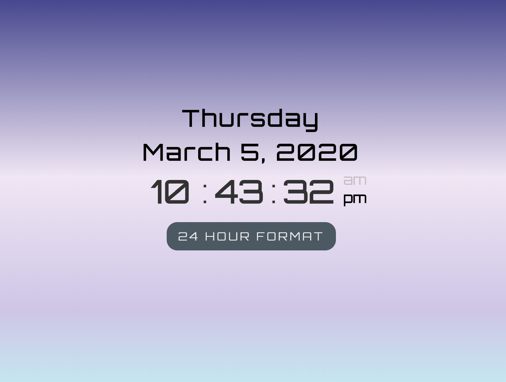

# Clock App

Create a digital clock using HTML, CSS and vanilla Javascript.

[View the Clock App](https://m2paulc.github.io/clockApp/)

## Summary:

I built the clock app within a day. I want to incorporate the DRY (don't repeat yourself) programming concept and make it more modular for readability. I want to make sure this app is also viewable on mobile devices.

Ever since I learned how to code, I always want to make my code readable and easy to debug. That is my goal in building this despite the simple functionality of the app.

## Author:

Paul Caoile - Front-end Developer
